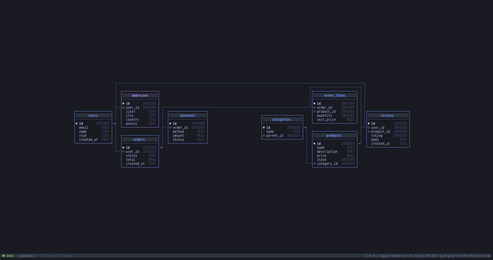

<h1>
<p align="center">
  
  <br>creel
</h1>

<p align="center">
  <a href="https://github.com/rsiota/creel/actions/workflows/ci.yml"></a>
  <a href="https://github.com/rsiota/creel/releases/latest"></a>
  <a href="https://pkg.go.dev/github.com/rsiota/creel"></a>
  <a href="https://goreportcard.com/report/github.com/rsiota/creel"></a>
  <a href="LICENSE"></a>
</p>
<p align="center">
  <a href="docs/images/demo.gif">
    
  </a>
</p>
<p align="center"><em>A quick tour of creel, recorded with <a href="https://asciinema.org">asciinema</a>. From a clone: <code>asciinema play demo.cast</code></em></p>

A fast, memory-efficient SQL TUI for **SQLite**, **MySQL**, and **PostgreSQL**, written in Go.

Inspired by [sqlit](https://github.com/Maxteabag/sqlit) (Python/Textual), `creel` brings a vim-driven, keyboard-first workflow to browsing schemas, running queries, and editing data — all from the terminal.

## Quickstart

```sh
brew install rsiota/creel/creel        # or: go install github.com/rsiota/creel/cmd/creel@latest
creel                                  # press Enter on "Try the demo database", or n to add a connection
```

To explore the bundled sample database (shown in the demo and screenshots):

```sh
git clone https://github.com/rsiota/creel.git && cd creel
creel -database demo/creel-demo.db     # then press g R for the ERD, g r on a row for its relationships
# or just: creel   # empty picker → Enter on the demo invitation
```

Linux, macOS, and Windows binaries are on the [latest release](https://github.com/rsiota/creel/releases/latest).

## Features

**Connect**

- Three databases, one interface — SQLite, MySQL, and PostgreSQL, with SSH tunneling, TLS (`sslmode`), and unix sockets for remote MySQL and PostgreSQL.
- Secret storage — passwords live in the OS keychain (macOS/Windows/Linux), with a plaintext fallback if no keychain is available.
- Read-only mode — point creel at production safely; per-connection flag or global `-readonly`.

**Browse**

- Table browser — expand columns, inspect schemas, fuzzy-filter.
- Results grid — sort, filter, search, hide columns, follow foreign keys (`g d`), soft FK cell tint, chart columns (`M` + `:bar` / `:line` / `:scatter` / `:hist` / `:freq`).
- Relationship explorer (`g r`) — browse a row's inbound/outbound FK graph like a folder.
- Static ERD (`g R`) — graphical entity-relationship diagram; exportable as Mermaid.
- EXPLAIN plans (`g e`), cross-table search (`S`), column statistics (`g s`).

<p align="center">
  
</p>

**Edit**

- Inline editing — edit cells, insert/clone rows, paste from clipboard.
- Schema editing — add columns, rename/drop/truncate tables, table designer (`N`), structure view (`d`).
- Import / export — streaming SQL dump importer (`I`), `mysqldump`-compatible exporter (`X`), `:backup` / `:restore` via the native `mysqldump` / `mysql` CLIs (including over SSH), CSV/result export.

**Workflow**

- Vim-mode editor — normal/insert modes, motions, operators, undo/redo, buffer search, visual line, SQL autocompletion.
- Query parameters — `:param start 2026-01-01` then `:start` in SQL; status bar shows `PARAM n`.
- Query history & bookmarks — per-connection, persisted, searchable.
- Session restore — reopen a connection to find your tabs and buffers as you left them.
- Record inspector — side panel form view tracking the results cursor.
- Command palette (`Ctrl+P`) — jump to tables, bookmarks, themes, or replay keybindings; help overlay (`?`).
- AI assistant (`Ctrl+F`) — natural-language to SQL via any OpenAI-compatible endpoint; `:aifix` rewrites the last failed query; `:aiexplain` / `:why` explains a query with its EXPLAIN plan.

**Run anywhere** — large result sets are paged for speed and low memory, and a CLI mode (`-e`, `-e -` from stdin, `-format`) runs a query and prints results without the TUI (failures exit `1`).

See [Features](docs/features.md) for charts, the relationship explorer, the ERD, and the rest.

## How creel compares

creel isn't trying to replace a database GUI — it's a fast, keyboard-first terminal tool. A few reference points:

| | creel | dbcli (pgcli / mycli / litecli) | sqlit | usq |
| --- | --- | --- | --- | --- |
| Language | Go — one static binary, no runtime deps | Python | Python | Go |
| Databases | SQLite, MySQL, PostgreSQL | one tool per database | SQLite, MySQL, PostgreSQL, SQL Server, Turso, … | many drivers |
| Interaction | vim modal editor + editable results grid | REPL prompt (optional vi mode) + pager | TUI | prompt-style (psql-like) |
| Schema view | ERD (`g R`) + relationship explorer (`g r`) | — | — | — |

In short: the **dbcli** tools are mature, battle-tested REPLs with excellent autocompletion — reach for them if you want a smart prompt. **sqlit** (which inspired creel) is a polished multi-database TUI in Python/Textual. **usq** is a Go universal CLI spanning many drivers. creel's angle is a **single, dependency-free Go binary** with a **vim-native editor**, **graphical schema exploration**, and **in-grid charts**, built for browsing and editing relational data quickly.

## Documentation

| Topic | Description |
| --- | --- |
| [Features](docs/features.md) | What creel can do, in depth. |
| [Keybindings](docs/keybindings.md) | Every key in every panel (also `?` in-app). |
| [Configuration](docs/configuration.md) | `config.yaml`, secrets, read-only mode, groups, AI assistant, settings, themes. |
| [CLI mode](docs/cli.md) | Running queries headlessly with flags. |
| [Demo database](demo/README.md) | The bundled e-commerce schema used in the screenshots. |
| [Architecture](docs/architecture.md) | Subsystem map and design decisions. |

## Install

**GitHub Release** (Linux, macOS, Windows):

Download the archive for your OS from the [latest release](https://github.com/rsiota/creel/releases/latest).

**Homebrew** (tap):

```sh
brew install rsiota/creel/creel
```

**go install**:

```sh
go install github.com/rsiota/creel/cmd/creel@latest
```

**Build from source** (requires Go 1.26+):

```sh
git clone https://github.com/rsiota/creel.git
cd creel
go build -o creel ./cmd/creel/
```

The config lives at `~/.config/creel/config.yaml` and is created on first run. If you used the old `gsql` name, that directory migrates on first launch — see [Configuration](docs/configuration.md).

The TUI is a Bubble Tea app over a small driver layer (SQLite, MySQL, PostgreSQL). See [Architecture](docs/architecture.md) for the subsystem map.

## Contributing

Issues and pull requests are welcome — see [CONTRIBUTING.md](CONTRIBUTING.md)
for how to build, test, and add keybindings or database drivers, and
[ROADMAP.md](ROADMAP.md) for the direction of the project. Bug reports and
feature requests use the [issue templates](.github/ISSUE_TEMPLATE). This
project follows the [Contributor Covenant](CODE_OF_CONDUCT.md) code of conduct.

## License

[MIT](LICENSE)
