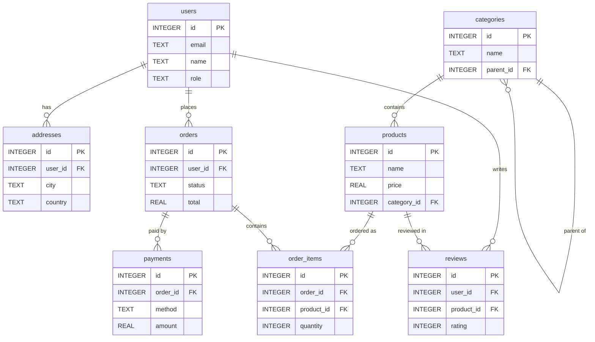

# Features

An overview of everything creel can do. For keys, see
[Keybindings](keybindings.md); for connection and app settings, see
[Configuration](configuration.md).

## Connecting

- **Three databases, one interface** — connect to SQLite, MySQL, or PostgreSQL,
  with SSH tunneling for remote MySQL and PostgreSQL, TLS (`sslmode`), and
  unix sockets.
- **Keep-alive / reconnect** — MySQL and Postgres connections are pinged in the
  background; dropped SSH tunnels or idle sessions rebuild in place with a
  status-bar “reconnecting…” (also `:reconnect`). The workspace stays open.
- **Secret storage** — passwords and SSH passwords are stored in the OS keychain
  (macOS Keychain, Windows Credential Manager, Linux Secret Service) rather than
  plaintext config, falling back to plaintext on systems without a keychain. See
  [Configuration → Secret storage](configuration.md#secret-storage).
- **Read-only mode** — point creel at production safely. See
  [Configuration → Read-only mode](configuration.md#read-only-mode).

## Browsing

- **Table browser** — expand/collapse columns, inspect schemas, fuzzy-filter
  tables.
- **Results grid** — sort, filter, search, hide/show columns, follow foreign
  keys (`g d`), mark rows and columns, bulk-delete rows, and chart marked
  columns with `:bar` / `:line` / `:scatter` / `:hist` / `:freq`. Large result sets are paged
  (LIMIT/OFFSET) for speed and low memory. Bang forms (`:bar!`, `:line!`,
  `:scatter!`, `:hist!`, `:freq!`) re-run the last SELECT without the page
  LIMIT (capped at 50,000 rows).

### Bar chart (`M` + `:bar`)

Mark two columns with `M` (first = labels, second = values), then run `:bar`
to replace the results grid with a horizontal bar chart of the current page.
Or pass columns explicitly: `:bar <label> <value> [sum|count|avg]`. One
column is a frequency count: `:bar status`, a single `M` mark, or
`:bar status count`. Duplicate labels are grouped (`sum` is the default on
two columns); `:bar count` on two marked columns counts rows per label. The
top 20 bars are kept and the rest fold into `(other)`; press `o` to unfold
(and `o` again to fold). `Enter` on a bar keeps rows with that label and
restores the grid. `Esc`/`q` closes the chart. Non-numeric and NULL
value cells are skipped for `sum`/`avg`. `:bar!` charts every row of the
last SELECT (not just the current page).

### Frequency (`:freq`)

Count distinct values in one column, using the same bar panel as `:bar`.
`:freq` uses the cursor column (or a single `M` mark); `:freq status` names
the column. `Enter` on a bar keeps those rows. `:freq!` uses every row of
the last SELECT.

### Line chart (`M` + `:line`)

Mark two numeric or datetime columns with `M` (first = x, second = y), then
run `:line` to plot them in the results slot, sorted by x. Or `:line <x> <y>`.
`h`/`l` (or `j`/`k`) move a cursor along the series; `Esc`/`q` restores the
grid. Datetime cells (ISO-8601, `YYYY-MM-DD HH:MM:SS`, date-only) are placed
by Unix time; the original text is the axis label. Other non-numeric and NULL
cells are skipped. Negative numbers are kept. `:line!` charts every row of
the last SELECT.

### Scatter chart (`M` + `:scatter`)

Same columns as `:line`, but each sample is a point with no connecting
stroke — use this for correlation (`amount` vs `age`) rather than a series.
Or `:scatter <x> <y>`. Cursor and bang (`:scatter!`) work like `:line`.

### Histogram (`:hist`)

Bin one numeric column into equal-width bars in the same panel. `:hist`
uses the cursor column (or a single `M` mark); `:hist amount` names the
column; `:hist amount 12` (or `:hist 12`) sets the bin count. Default bins
follow Sturges' formula, clamped to 8–20 (max 100). Empty bins are shown;
negatives are kept; there is no `(other)` fold. `Enter` on a bin keeps rows
in that range. `:hist!` uses every row of the last SELECT.

### Relationship explorer (`g r` / `:explore panel`)

A docked panel that browses a row like a folder: an expandable object-graph
tree of the focused row's inbound and outbound foreign keys, with a live
per-edge count. Expand an edge (`→`) to see the related rows inline, expand a
row to see *its* edges, and so on (depth-capped); `Enter` opens a node in the
grid (replacing this tab), `t` opens it in a new tab so the parent stays,
`A` on an inbound edge inserts a related row into the child table without
leaving the parent grid (the explorer yields the inspector, then comes back
on save or cancel), `←` collapses, `r` retargets.
The panel stays open and re-roots as the cursor moves. When the results
cursor sits on a foreign-key column, the matching outbound edge is highlighted
(and selected, while the grid has focus). Counts and child rows
fan out concurrently across all three drivers.

### Static ERD (`g R` / `:erd`)

Renders a graphical entity-relationship diagram in a scrollable panel: bordered
table cards laid out in dependency-ranked columns with box-drawing arrows from
each FK to the PK it references (◆ = PK, ◇ = FK). `m` toggles to the Mermaid
`erDiagram` source; `y`/`s` copy/save the Mermaid (renders natively in
GitHub/GitLab markdown).

Navigate by mouse — hover a card to pop up a tooltip of the info it doesn't
already show (an expanded card lists its FK references, e.g.
`user_id → users.id`, which you'd otherwise trace an arrow for; a collapsed
card reveals its hidden columns), click a card to highlight its relationships
(dimming the rest), double-click to browse the table (`SELECT *`, same as
Enter), or in a focused ERD click a related table's header (marked `◎`) to
re-focus on its neighbourhood — or by keyboard: `j`/`k`/`h`/`l` move a focus
between cards (the viewport follows), `Space` highlights the focused card,
`Enter` closes the ERD and runs `SELECT *` on that table, `f` re-focuses the
ERD on its neighbourhood, `/` jumps to a table by name (`Tab` cycles matches), `p` traces the shortest FK
path between two tables (anchor one, move to the other, `p` again), `zz` fits
all cards to the viewport, `zc`/`zo`/`za` collapse/expand/toggle a focused card
to a header-only bar to declutter dense schemas (▸ marks a folded card),
`zM`/`zR` collapse/expand every card at once (the layout contracts to reclaim
the freed space, arrows re-route, and the view reframes), and `g`/`G`/`ctrl+d`/
`ctrl+u` page the view.

<b>Mermaid source for the bundled demo database</b>

(`demo/schema.sql` — a small e-commerce schema; `g R` inside creel renders the
interactive version.)

### EXPLAIN, search, statistics

- **EXPLAIN plans** — driver-aware rendering (`g e`) of query plans.
- **Cross-table search** (`S`) and **column statistics** (`g s`).

## Editing

- **Inline editing** — edit cells directly, insert rows, clone rows, paste from
  clipboard.
- **Manual transactions** — `:begin` / `:commit` / `:rollback`, with optional
  isolation (`:begin serializable`, `:begin repeatable read`, `:begin read
  committed`, …). The status bar shows `TXN ●` (or `TXN S` / `TXN RR` / …).
- **Record inspector** — side panel with a vertical form view that tracks the
  results cursor.
- **Schema editing** — add columns, rename tables, create/drop/truncate tables,
  and a grid-based table designer (`N`).
- **Table structure view** (`d`) — a tabbed structure editor: columns (editable
  grid), foreign keys, indexes, check constraints, and triggers in one view,
  plus a definition tab for views.
- **Import / export** — streaming SQL dump importer (`I`) that understands
  MySQL/Sequel Ace dumps (`\'` escapes, backticks, `#` comments) and a
  pure-Go `mysqldump`-compatible exporter (`X`) that uses native CREATE TABLE
  DDL (MySQL `SHOW CREATE TABLE`, SQLite `sqlite_master`); result-set export
  via the `g X` dialog (format, columns, and whole-table/marked/page scope)
  or instant CSV (`x`).

## Workflow

- **Vim-mode editor** — normal/insert modes, motions (`h/j/k/l`, `w/b`),
  operators (`dd`, `dw`, `x`, `D`), yank/paste, undo/redo (`u`/`U`), buffer
  search (`/` + `n`/`N`), visual line (`V`), and SQL autocompletion.
- **Query history & bookmarks** — per-connection, persisted, searchable.
- **Session restore** — reopening a connection brings back your open tabs and
  editor buffers from the last visit (keyed per connection + database). Buffers
  are restored but not re-executed; a `creel -f` startup file still takes
  precedence on first connect. `:session clear` wipes the saved snapshot,
  `:session save` snapshots now.
- **Command palette** (`Ctrl+P`) and a full **help overlay** (`?`).
- **AI assistant** — turn a natural-language question into SQL using any
  OpenAI-compatible endpoint. See
  [Configuration → AI assistant](configuration.md#ai-assistant).
